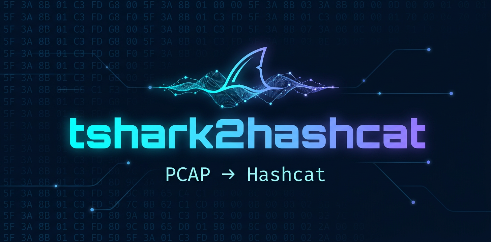

<p align="center">
  
</p>

<p align="center">
  <a href="https://www.python.org/downloads/"></a>
  <a href="https://www.wireshark.org/"></a>
  <a href="https://hashcat.net/hashcat/"></a>
  <a href="LICENSE"></a>
</p>

<p align="center">
  <b>Extraction de hashes Hashcat et de données sensibles depuis un PCAP, via Tshark.</b><br>
  <i>Un fichier ou un dossier — tout dans Excel.</i>
</p>

<p align="center">
  <code>v1.0.0</code> &nbsp;·&nbsp; Windows &nbsp;·&nbsp; Linux &nbsp;·&nbsp; macOS
</p>

---

## Sommaire

- [Présentation](#présentation)
- [Fonctionnalités](#fonctionnalités)
- [Protocoles détectés](#protocoles-détectés)
- [Installation](#installation)
  - [1. Prérequis système](#1-prérequis-système)
  - [2. Récupérer l'outil](#2-récupérer-loutil)
  - [3. Dépendances Python](#3-dépendances-python)
  - [4. Vérifier l'environnement](#4-vérifier-lenvironnement)
- [Démarrage rapide](#démarrage-rapide)
- [Sous-commandes](#sous-commandes)
- [Exports](#exports)
- [Configuration](#configuration)
- [Fonctionnement interne](#fonctionnement-interne)
- [Limites connues](#limites-connues)
- [Dépannage](#dépannage)
- [Structure du projet](#structure-du-projet)
- [Contribuer](#contribuer)
- [Licence](#licence)

---

## Présentation

**tshark2hashcat** analyse une capture réseau `.pcap` / `.pcapng` / `.cap`
**uniquement via Tshark** (un seul appel `tshark -r … -T json -x`) et en extrait :

- les **hashes cassables par Hashcat** (NetNTLM, Kerberos, WPA, APOP, SIP, JWT, CHAP…) ;
- les **identifiants en clair** (FTP, Telnet, HTTP Basic, formulaires, AUTH PLAIN/LOGIN…) ;
- les **secrets et métadonnées** (community SNMP, cookies, tokens, e-mails, clés API, SNI…) ;
- un **rapport d'audit complet** : score de protection, constats, chemins d'attaque,
  mapping MITRE ATT&CK, écarts attendu/observé, cartographie du domaine.

Chaque ligne de hash n'est écrite **que si elle respecte exactement la grammaire du
mode Hashcat correspondant** (validateurs intégrés). Mieux vaut rater un hash que
d'écrire une ligne invalide.

> **Usage légal.** Outil destiné à l'audit de sécurité, au pentest et aux CTF,
> sur des captures que vous êtes autorisé à analyser.

---

## Fonctionnalités

- **Un seul fichier** Python, sans installation de paquet : `tshark2hashcat.py`.
- **Menu interactif** (1 fichier / 2 dossier / 0 quitter) — aucune commande à retenir.
- **Dossier complet → un seul classeur Excel**, extraction parallèle des captures.
- **Double chemin d'extraction** : champs disséqués tshark en priorité, scan binaire
  des octets bruts (`-x`) en secours (NTLMSSP mal marqué, base64 HTTP/IMAP/SMTP).
- **Rapport Excel riche** : Couverture, Analyse, Findings, MITRE, Chemins d'attaque,
  Écarts, Cartographie, OSINT, Identités, Hôtes, Wi-Fi, Fichiers, Secrets, Hashes, Kerberos.
- **Filtrage du bruit** : fuzz SNMP, bannières SSH, cookies Cloudflare écartés du rapport.
- **Wrapper tshark complet** : stats `-z`, follow, objets, filtres, convert, capture live…
- **i18n** français / anglais (`--lang en`).

---

## Protocoles détectés

| Protocole | Détection | Mode Hashcat |
|:---|:---|---:|
| NetNTLMv2 | NTLMSSP AUTH — NT response > 24 octets | `-m 5600` |
| NetNTLMv1 (+ESS) | NTLMSSP AUTH — NT response = 24 octets | `-m 5500` |
| Kerberos AS-REQ | msg-type 10, PA-ENC-TIMESTAMP | `-m 7500` · `19800` · `19900` |
| Kerberos AS-REP | msg-type 11, enc-part | `-m 18200` · `32100` · `32200` |
| Kerberos TGS-REP | msg-type 13, ticket | `-m 13100` · `19600` · `19700` |
| APOP (POP3) | digest = MD5(challenge + mot de passe) | `-m 20` |
| WPA PMKID | RSN IE / EAPOL M1 | `-m 22000` |
| SIP Digest | `Authorization: Digest` | `-m 11400` |
| JWT | `Bearer eyJ…` | `-m 16500` |
| CHAP | champs tshark CHAP présents | `-m 4800` |
| Identifiants clairs | FTP/Telnet USER+PASS, HTTP Basic, AUTH PLAIN/LOGIN | → `credentials.txt` |
| Secrets divers | SNMP community, cookies, LDAP, PAP, tokens, clés API/AWS | → rapport |

S'y ajoutent HTTP Digest (documenté dans le rapport), CRAM-MD5 (note + follow-stream),
et la consultation du catalogue complet de modes intégré (`modes`).

**Note OSPF.** Hashcat n'a pas de mode OSPF natif, et l'OSPF utilisant le crypto-auth
LLS (RFC 4813) n'est pas cassable tel quel par hashcat.

En fin d'exécution, une section **« Identités Kerberos vues »** affiche pour chaque
message : n° de trame, type (AS-REQ / AS-REP / TGS-REP), utilisateur, realm, SPN,
salt (ETYPE_INFO2) et etypes — utile pour vérifier la casse exacte d'un
userPrincipalName (format de flag CTF, etc.).

---

## Installation

### 1. Prérequis système

| Élément | Version minimale | Rôle |
|:---|:---:|:---|
| [Python](https://www.python.org/downloads/) | 3.10 | moteur de l'outil |
| [Wireshark / tshark](https://www.wireshark.org/) | récente | dissection des captures |
| [hashcat](https://hashcat.net/hashcat/) *(optionnel)* | récente | cassage des hashes extraits |

**Linux (Debian / Ubuntu)**

```bash
sudo apt update
sudo apt install python3 python3-pip tshark        # ou wireshark (GUI incluse)
sudo apt install hashcat                          # optionnel
```

**Linux (Fedora)**

```bash
sudo dnf install python3 wireshark-cli hashcat
```

**macOS (Homebrew)**

```bash
brew install python wireshark hashcat
```

**Windows**

```powershell
winget install Python.Python.3.12
winget install WiresharkFoundation.Wireshark      # fournit tshark.exe
winget install Hashcat.Hashcat                    # optionnel
```

> Sous Windows, si tshark n'est pas dans le `PATH`, passez le chemin complet :
> `python tshark2hashcat.py --tshark "C:\Program Files\Wireshark\tshark.exe" …`

### 2. Récupérer l'outil

```bash
git clone https://github.com/tshark2hashcat/tshark2hashcat
cd tshark2hashcat
```

Ou téléchargez simplement le fichier `tshark2hashcat.py` : c'est tout ce dont
l'outil a besoin.

### 3. Dépendances Python

| Paquet | Statut | Apport |
|:---|:---|:---|
| `openpyxl` | recommandé | export Excel `.xlsx` (classeur complet) |
| `rich` | optionnel | couleurs, tableaux, barres de progression |
| `tqdm` | optionnel | barres de progression de repli |

```bash
pip install openpyxl rich tqdm
```

Sans ces paquets, l'outil fonctionne en mode texte brut (exports CSV/JSON/TXT inclus).

### 4. Vérifier l'environnement

```bash
python tshark2hashcat.py doctor
```

Sortie attendue : chemins de `tshark`, `dumpcap`, `capinfos`, `editcap`, `mergecap`,
version détectée, et état des dépendances Python.

```text
┌ Suite Wireshark ────────────────────────
│ tshark      /usr/bin/tshark
│ version     TShark (Wireshark) 4.x.x
│ openpyxl    ok
└─────────────────────────────────────────
✓ environnement opérationnel
```

---

## Démarrage rapide

**Menu interactif — aucune commande à retenir**

```bash
python tshark2hashcat.py
```

```text
  tshark2hashcat  —  menu
  ────────────────────────────────────────────────────────
    1.  Un fichier   →   Excel + txt Hashcat
    2.  Un dossier   →   Excel + txt Hashcat (tous les pcap)
    0.  Quitter
```

**Un fichier — tout extraire**

```bash
python tshark2hashcat.py auto capture.pcapng
```

Produit le classeur `tshark2hashcat-rapport.xlsx`, un fichier `.txt` par mode Hashcat
(prêt à lancer : `hashcat -m <mode> hashes_m<mode>.txt wordlist.txt`), et affiche le
rapport d'audit dans le terminal.

**Un dossier de captures — un seul classeur Excel**

```bash
python tshark2hashcat.py folder ./captures -o audit.xlsx
```

Tous les `.pcap` / `.pcapng` / `.cap` du dossier (récursif) sont extraits en parallèle
puis fusionnés dans un unique classeur (onglet « Fichiers » récapitulatif inclus).

**Compatibilité directe**

```bash
python tshark2hashcat.py capture.pcapng     # = auto
python tshark2hashcat.py ./captures         # = folder
python tshark2hashcat.py dump_tshark.json   # relit un export JSON tshark
```

---

## Sous-commandes

| Commande | Description |
|:---|:---|
| `auto` | Analyse automatique d'un fichier : hashes + secrets + rapport |
| `folder` | Dossier de captures → un seul classeur Excel |
| `extract` | Extraire les hashes et identifiants, formats au choix |
| `analyze` | Analyse complète : protocoles, conversations, endpoints, expert |
| `stats` | Statistiques tshark `-z` : `io,phs`, `conv`, `endpoints`, `http`, `dns`… |
| `packets` | Lister / exporter les paquets : filtre d'affichage, champs, CSV/JSON/XLSX |
| `follow` | Suivre un flux TCP / UDP / HTTP / TLS / SIP |
| `objects` | Exporter les objets : HTTP, SMB, IMF, TFTP, DICOM |
| `filter` | Filtrer une capture et ré-écrire un `.pcap` / `.pcapng` |
| `report` | Rapport de synthèse HTML / Markdown / JSON / XLSX |
| `creds` | Extraire uniquement les identifiants en clair |
| `convert` | Convertir pcap ↔ pcapng, découper, fusionner |
| `capture` | Capture live, wrapper `tshark -i` |
| `decode` | Forcer un décodage, `decode-as` |
| `fields` | Extraire des champs tshark, `-T fields -e …` |
| `info` | Métadonnées de la capture, `capinfos` |
| `ifaces` | Lister les interfaces de capture |
| `protocols` | Lister les protocoles / champs tshark, `-G` |
| `expert` | Infos expert Wireshark : erreurs, warnings |
| `hosts` | Extraire les hôtes DNS / IP |
| `voip` | Flux RTP / SIP / VoIP |
| `hashcat` | Générer la commande Hashcat adaptée à un fichier de hashes |
| `modes` | Catalogue des modes Hashcat connus |
| `filters` | Bibliothèque de filtres d'affichage |
| `tshark-help` | Catalogue des options et statistiques tshark |
| `wizard` | Assistant interactif guidé |
| `doctor` | Vérifier tshark, editcap, mergecap, dépendances |
| `examples` | Exemples d'utilisation |
| `init-config` | Écrire un fichier de configuration exemple |

**Exemples**

```bash
# extraction simple, puis multi-formats
python tshark2hashcat.py extract capture.pcapng
python tshark2hashcat.py extract dump.pcap -o hashes.txt -f txt,csv,json,xlsx

# analyse et statistiques
python tshark2hashcat.py analyze capture.pcapng
python tshark2hashcat.py stats capture.pcapng -z io,phs

# paquets HTTP vers Excel
python tshark2hashcat.py packets dump.pcap -Y http -o http.xlsx

# suivi de flux, export d'objets, ré-export filtré
python tshark2hashcat.py follow capture.pcapng --tcp 0
python tshark2hashcat.py objects capture.pcapng --proto http
python tshark2hashcat.py filter capture.pcapng -Y kerberos -o kerberos.pcapng

# côté cassage
hashcat -m 5600  hashes_m5600.txt  wordlist.txt
hashcat -m 18200 hashes_m18200.txt wordlist.txt
hashcat -m 22000 hashes_m22000.txt wordlist.txt
```

---

## Exports

| Format | Contenu |
|:---|:---|
| TXT | un fichier par mode Hashcat (`*_m5600.txt`, `*_m18200.txt`…) |
| CSV | table unique hashes + identifiants, colonnes `extra_*` incluses |
| JSON | méta, hashes, identifiants, identités Kerberos, commandes hashcat |
| XLSX | classeur complet : Couverture, Analyse, Findings, MITRE, Chemins, Écarts, Cartographie, OSINT, Identités, Hôtes, Wi-Fi, Fichiers, Secrets, Hashes, Kerberos |
| HTML | rapport sombre autonome |
| Markdown | rapport texte |
| PCAP / PCAPNG | ré-export filtré via `filter` |

---

## Configuration

Ordre de priorité, du plus spécifique au plus général :

1. arguments CLI ;
2. variables d'environnement `T2H_*` (`T2H_LANG`, `T2H_TSHARK_PATH`, `T2H_OUTPUT`…) ;
3. fichier `./tshark2hashcat.toml` / `./tshark2hashcat.json` / `~/.tshark2hashcat.toml` ;
4. valeurs par défaut.

```bash
python tshark2hashcat.py init-config -o tshark2hashcat.json
```

Options notables : `lang` (fr/en), `formats`, `tshark_path`, `wordlist`,
`include_wpa` / `include_kerberos` / `include_ntlm` / `include_apop` / `include_creds`,
`raw_scan`, `no_banner`, `quiet`, `verbose`.

---

## Fonctionnement interne

- **Un seul appel tshark** : `tshark -r <pcap> -T json -x`.
  Les champs disséqués (`ntlmssp.*`, `kerberos.*`…) sont utilisés en priorité ;
  le `-x` fournit les octets bruts de chaque couche — si le dissecteur n'a pas reconnu
  l'encapsulation (NTLMSSP mal marqué, par exemple), les messages sont retrouvés par
  **signature binaire**, en clair comme en base64 (HTTP / IMAP / SMTP).
- **Appairage challenge / auth** NTLM par 4-tuple IP / ports.
- **Gros fichiers** : découpe automatique en morceaux (`editcap`) et extraction parallèle.
- **Dédoublonnage** systématique des hashes, identités Kerberos et secrets.
  Le bruit — fuzz SNMP, bannières SSH prises pour des e-mails, cookies Cloudflare —
  est écarté du rapport.

---

## Limites connues

- **WPA `WPA*02*`** (handshake EAPOL complet) : sans les octets EAPOL bruts, hashcat ne
  peut pas vérifier le MIC. Sur du Wi-Fi « sale », préférer
  `hcxpcapngtool -o handshake.22000 capture.pcapng`.
  L'outil couvre le cas propre : PMKID et 4-way handshake avec SSID connu.
- **OSPF** : pas de mode hashcat natif (voir [Protocoles détectés](#protocoles-détectés)).
- **CRAM-MD5** : détecté et documenté ; l'export `-m 10200` passe par le suivi de flux
  SMTP / IMAP (`follow`).

---

## Dépannage

| Symptôme | Solution |
|:---|:---|
| `tshark introuvable` | installez Wireshark, ou `--tshark CHEMIN`, ou `T2H_TSHARK_PATH` |
| `openpyxl est requis pour l'export Excel` | `pip install openpyxl` |
| `Aucun hash produit` | vérifiez que la capture contient de l'auth NTLMSSP / Kerberos / WPA ; essayez `-v` pour voir les éléments ignorés |
| Couleurs illisibles | `--no-color` |
| Capture énorme, lente | `--limit N` pour borner, ou laisser la découpe parallèle automatique (`folder`) |
| Permission de capture refusée (Linux) | groupe `wireshark` : `sudo usermod -aG wireshark $USER` puis reconnexion |

---

## Structure du projet

```text
tshark2hashcat/
├── tshark2hashcat.py      # l'outil complet (un seul fichier)
├── assets/
│   └── banner.png         # bannière du dépôt
├── README.md
└── LICENSE
```

Le fichier unique embarque : utilitaires, i18n FR/EN, bannière, barres de progression,
configuration, validateurs Hashcat, catalogue de modes, extracteurs
(NTLM, Kerberos, WPA, APOP, identifiants, secrets, SIP/JWT/CHAP), rapports réseau /
audit / OSINT, wrapper tshark, exports, et CLI.

---

## Contribuer

Les issues et pull requests sont bienvenues : nouveaux extracteurs, modes Hashcat,
traductions, filtres. Gardez le fichier unique, les validateurs stricts, et la doc FR/EN.

---

## Licence

MIT — voir l'en-tête de `tshark2hashcat.py`.

<p align="center">
  <i>tshark2hashcat — tous les protocoles, sécurisés ou non.</i>
</p>

