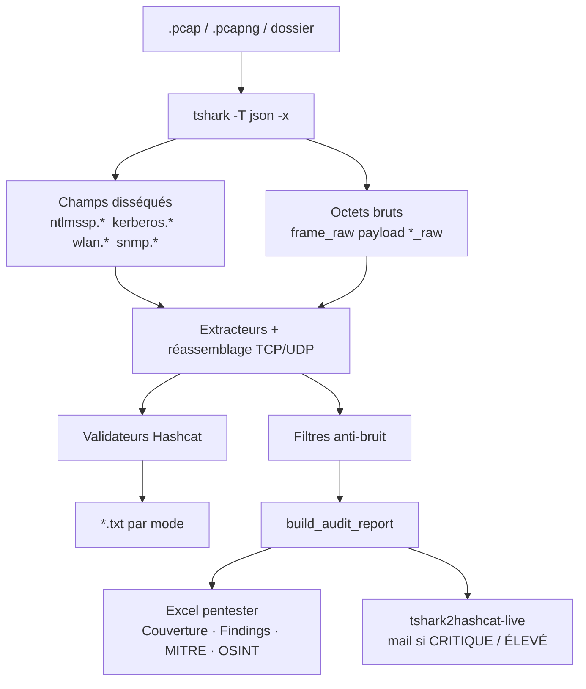

<div align="center">


# tshark2hashcat

**Hashes Hashcat + rapport d’audit pentester, à partir d’un pcap.**  
Une seule source de données : **Tshark**. Un fichier, ou un dossier. Tout dans Excel.

[](#)
[](https://www.python.org/)
[](#prérequis)
[](#architecture)
[](LICENSE)

```
  ████████╗███████╗██╗  ██╗ █████╗ ██████╗ ██╗  ██╗██████╗
  ╚══██╔══╝██╔════╝██║  ██║██╔══██╗██╔══██╗██║ ██╔╝╚════██╗
     ██║   ███████╗███████║███████║██████╔╝█████╔╝  █████╔╝
     ██║   ╚════██║██╔══██║██╔══██║██╔══██╗██╔═██╗ ██╔═══╝
     ██║   ███████║██║  ██║██║  ██║██║  ██║██║  ██╗███████╗
     ╚═╝   ╚══════╝╚═╝  ╚═╝╚═╝  ╚═╝╚═╝  ╚═╝╚═╝  ╚═╝╚══════╝
  ██╗  ██╗ █████╗ ███████╗██╗  ██╗ ██████╗ █████╗ ████████╗
  ██║  ██║██╔══██╗██╔════╝██║  ██║██╔════╝██╔══██╗╚══██╔══╝
  ███████║███████║███████╗███████║██║     ███████║   ██║
  ██╔══██║██╔══██║╚════██║██╔══██║██║     ██╔══██║   ██║
  ██║  ██║██║  ██║███████║██║  ██║╚██████╗██║  ██║   ██║
  ╚═╝  ╚═╝╚═╝  ╚═╝╚══════╝╚═╝  ╚═╝ ╚═════╝╚═╝  ╚═╝   ╚═╝
```

`un fichier ou un dossier · tout dans Excel`

</div>

---

## Présentation

`tshark2hashcat` prend une capture `.pcap` / `.pcapng` (ou un dossier entier), la fait disséquer par **Tshark** (`-T json -x`) et en sort deux livrables utiles sur le terrain :

1. **Des hashes prêts pour Hashcat** — un fichier par mode, validés, dédupliqués.
2. **Un rapport d’audit réseau** — Excel pentester : conclusion, findings, expositions, cartographie, MITRE ATT&CK, chemins d’attaque, écarts de contrôle, OSINT / PII, secrets.

Le programme ne devine pas. Un challenge NTLM sans réponse n’est pas un hash. Un TGS `cifs/DC$` n’est pas un Kerberoast. Un cookie Cloudflare n’est pas un secret. Un compte `MACHINE$` n’est pas une personne.

Destiné aux **pentesters**, **analystes forensic**, **équipes bleu / SOC** et **CTF**, dans un cadre autorisé.

> **Cadre légal** — Uniquement sur des captures que vous êtes autorisé à analyser : labo, CTF, audit contractuel, environnement de test. Les identifiants en clair et les tickets Kerberos sont des secrets. Traitez le classeur Excel comme un livrable confidentiel.

## Sommaire

- [Fonctionnalités](#fonctionnalités)
- [Menu](#utilisation)
- [Formats Hashcat](#formats-hashcat-supportés)
- [Rapport Excel](#rapport-excel)
- [Scoring](#scoring)
- [Ce que l’outil refuse de compter](#ce-que-loutil-refuse-de-compter)
- [Surveillance live](#surveillance-live)
- [Prérequis](#prérequis)
- [Installation](#installation)
- [Cassage avec Hashcat](#cassage-avec-hashcat)
- [Architecture](#architecture)
- [Limites](#limites-connues)
- [Dépannage](#dépannage)
- [Licence](#licence)

## Fonctionnalités

| | |
|---|---|
| **Menu numéroté** | `1` fichier · `2` dossier · `0` quitter. Pas de table de commandes à mémoriser. |
| **Un classeur** | Un pcap ou un dossier entier → **un seul Excel** + les `.txt` Hashcat. |
| **Tshark only** | Aucune librairie Python ne lit le pcap. Dissection + dump hex (`-x`) par Tshark. |
| **Tous les protocoles** | Clair ou chiffré. Rien n’est sauté « parce que le fichier est gros ». |
| **Validation Hashcat** | Séparateurs, longueurs, bornes. Ligne invalide → signalée, pas écrite. |
| **Kerberos honnête** | TGS machine / `cifs` / `ldap` / `host` = accès observé. Kerberoast = humain + SPN non-machine. |
| **Rapport pentester** | Conclusion rédigée, findings T2H-xx, MITRE, chemins, écarts — pas un dump de KPI. |
| **OSINT / PII** | Personnes, e-mails, téléphones, orgs, IP publiques. Les `user$` et les JA3 ne passent pas. |
| **Live** | `tshark2hashcat-live.py` capture, met à jour l’Excel, mail si non-conforme. |

## Utilisation

Lancez le script. Tapez un numéro.

```text
py tshark2hashcat.py
```

```text
  tshark2hashcat  —  menu
  ────────────────────────────────────────────────────────
    1.  Un fichier   →   Excel + txt Hashcat
    2.  Un dossier   →   Excel + txt Hashcat (tous les pcap)
    0.  Quitter

  Votre choix :
```

| Touche | Effet |
|:---:|---|
| **1** | Un `.pcap` / `.pcapng` → rapport + hashes |
| **2** | Un dossier (récursif) → **un** Excel fusionné |
| **0** | Quitter |

Le format de sortie et le nom du rapport sont choisis tout seuls. Pas de questionnaire.

### Ligne de commande (optionnel)

Le menu est l’interface par défaut. Les sous-commandes existent pour les scripts / CI :

```bash
python tshark2hashcat.py auto capture.pcapng
python tshark2hashcat.py folder ./captures/
```

Chemin Tshark forcé :

```powershell
python tshark2hashcat.py --tshark "C:\Program Files\Wireshark\tshark.exe"
```

Variable d’environnement équivalente : `T2H_TSHARK_PATH` ou `TSHARK`.

## Formats Hashcat supportés

| Authentification | Condition | Mode | Format |
|---|---|:---:|---|
| NetNTLMv2 | NT response > 24 o | `5600` | `user::domain:challenge:NTProofStr:blob` |
| NetNTLMv1 / ESS | LM + NT = 24 o | `5500` | `user::domain:LM:NT:challenge` |
| Kerberos AS-REP RC4 | etype 23 | `18200` | `$krb5asrep$23$…` |
| Kerberos AS-REP AES128 / AES256 | etype 17 / 18 | `32100` / `32200` | `$krb5asrep$17/18$…` |
| Kerberos AS-REQ (PA-ENC-TS) RC4 / AES | etype 23 / 17 / 18 | `7500` / `19800` / `19900` | `$krb5pa$…` |
| Kerberos TGS-REP RC4 / AES | etype 23 / 17 / 18 | `13100` / `19600` / `19700` | `$krb5tgs$…` |
| APOP | bannière `<challenge>` + `APOP` | `20` | `digest:challenge` |
| WPA/WPA2 PMKID + EAPOL | RSN / handshake M1+M2 | `22000` | `WPA*01*` / `WPA*02*` |
| SNMPv3 USM | auth USM | `25000`…`27300` | `$SNMPv3$…` |
| SIP Digest | `Authorization: Digest` | `11400` | `$sip$…` |
| JWT | `Bearer eyJ…` | `16500` | token JWT |
| CRAM-MD5 / Dovecot | IMAP / SMTP | `10200` / `16400` | |
| IKE-PSK | ISAKMP | `5300` / `5400` | |
| IPMI2 RAKP | HMAC-SHA1 | `7300` | |
| TACACS+ | | `16100` | |
| iSCSI CHAP | | `4800` | |
| PostgreSQL / MySQL CRAM | | `11100` / `11200` | |
| XMPP SCRAM | | `23200` | |
| AWS SigV4 | | `28700` | |
| MS SNTP | | `31300` | |

### Particularités

- **NetNTLMv2** — `NTProofStr` et blob séparés automatiquement, y compris depuis du Base64.
- **Kerberos RC4** — checksum en tête du cipher, format module Hashcat.
- **Kerberos AES** — checksum sur les 12 derniers octets.
- **PA-ENC-TIMESTAMP** — repli sur le DER brut si le JSON a perdu les champs répétés.
- **TGS `krbtgt` / `host/` / `cifs/` / `ldap/` / `MACHINE$`** — **pas** un Kerberoast. Comptés comme accès AD observé.
- **Kerberoast (T1558.003)** — uniquement demandeur humain + SPN de service non-machine.
- **WPA `WPA*02*`** — MIC remis à zéro dans la trame EAPOL avant écriture.
- **APOP** — pas de digest sans challenge de bannière.

### Identifiants en clair (pas un hash)

FTP `USER`/`PASS`, Telnet, HTTP Basic, formulaires HTTP, `AUTH PLAIN` / `AUTH LOGIN` (SMTP/IMAP/POP), community SNMP v1/v2c, cookies applicatifs, tokens Bearer.

Écrits dans l’onglet **Secrets** / **Identifiants** du classeur — pas dans un `.txt` séparé qui pollue le dossier.

## Rapport Excel

Un seul fichier : `tshark2hashcat-rapport.xlsx` (ou le préfixe de la capture).

| Onglet | Rôle |
|---|---|
| **Couverture** | Verdict, score, périmètre, conclusion rédigée, familles, findings en une page |
| **Findings** | Fiches T2H-xx : gravité, actifs, description, preuve, impact, remédiation, MITRE |
| **Expositions** | Vue courte destinée au client / à la synthèse |
| **Cartographie** | Domaine, DC, comptes, partages, hôtes, rôles |
| **MITRE** | Techniques réellement étayées par la capture |
| **Chemins** | Scénarios d’attaque (pas une checklist théorique) |
| **Écarts** | Contrôle attendu vs observé (MANQUANT / PARTIEL / OK) |
| **OSINT** | Personnes, e-mails, téléphones, orgs, IP publiques, machines |
| **Identités** | Comptes AD / UPN (les `user$` sont des machines, pas des gens) |
| **Secrets** | Vrais secrets. Pas `__cf_bm`, pas `cf_clearance` |
| **Hashes** | Inventaire des lignes Hashcat, mode par mode |
| **Paquets** | Volume et familles de protocoles |

À côté du classeur, **un `.txt` par mode Hashcat** :

```text
capture_m5600.txt
capture_m18200.txt
capture_m22000.txt
```

Rien d’autre n’est créé (pas de CSV / JSON / Markdown / `credentials.txt` en plus).

## Scoring

Le score n’est **pas** « présence du protocole = malus ».  
Il n’est **pas** non plus une somme brute de findings (ça plafonnait à 0/100 dès qu’un domaine AD parlait).

**Familles** (le plus grave de chaque famille compte, les doublons rapportent moins) :

| Rang dans la famille | Rendement |
|:---:|:---:|
| 1er finding | × 1.00 |
| 2e | × 0.55 |
| 3e | × 0.35 |
| suivants | × 0.20 |

```text
score = max(8, 100 − malus)
```

**CRITIQUE** si au moins un finding critique, **ou** un domaine AD avec ≥ 2 findings élevés, **ou** score < 35.

Exemple réel type FIRSTTOLAST (AD + WPAD + cookie applicatif + PII) : malus ≈ 31 → **~69 CRITIQUE**.  
Plus jamais `0/100` parce que 24 TGS `cifs/ldap` ont été comptés comme 24 Kerberoast.

## Ce que l’outil refuse de compter

| Bruit | Traitement |
|---|---|
| Compte `MACHINE$` / `name$@REALM` | Machine. Pas une personne, pas un e-mail |
| TGS `cifs/` `ldap/` `host/` `krbtgt` | Accès AD observé, **pas** T1558.003 |
| `__cf_bm`, `cf_clearance`, cookies Cloudflare | Jetés. Pas un secret |
| JA3 / JA3S / empreinte TLS | Pas un numéro de téléphone |
| Realm AD présenté comme un individu | Filtré |
| Community SNMP `public`/`private` floue sans contexte | Pas un finding critique tout seul |
| MAC vendue comme SSID | Non |

## Surveillance live

Script compagnon : [`tshark2hashcat-live.py`](tshark2hashcat-live.py).

```text
py tshark2hashcat-live.py
```

| Touche | |
|:---:|---|
| **1** | Capture temps réel → Excel mis à jour chaque cycle |
| **2** | Choisir l’interface |
| **3** | Tester l’envoi du mail |
| **4** | Rejouer un pcap (même document, mail si KO) |
| **0** | Quitter |

Un mail part **uniquement** si le niveau est `CRITIQUE` ou `ÉLEVÉ`, et **uniquement** quand un **nouveau** finding apparaît — pas un mail par minute.

Config locale : `t2h-live.conf` (destinataire, SMTP, intervalle). Mot de passe d’application Gmail, **jamais** dans le `.py`. Variable : `T2H_MAIL_PASS`.

Windows : Wireshark installé, script lancé **en administrateur**.

## Prérequis

| Composant | |
|---|---|
| **Python** | 3.10+ |
| **Tshark** | Fourni avec [Wireshark](https://www.wireshark.org/download.html) |
| **openpyxl** | Écriture du classeur Excel |
| **rich** | Optionnel — splash / menu couleur |
| **Hashcat** | Optionnel — cassage uniquement |

```bash
pip install openpyxl rich
```

Recherche automatique de Tshark :

```text
C:\Program Files\Wireshark\tshark.exe
C:\Program Files (x86)\Wireshark\tshark.exe
tshark          # PATH
```

## Installation

```bash
git clone https://github.com/<org>/tshark2hashcat.git
cd tshark2hashcat
pip install openpyxl rich
python tshark2hashcat.py
```

Un seul fichier à déployer côté extraction : `tshark2hashcat.py`.  
Le live est un second script, dans le même dossier.

Sous Windows : `py tshark2hashcat.py`.

## Cassage avec Hashcat

```bash
hashcat -m 5600  capture_m5600.txt  wordlist.txt
hashcat -m 18200 capture_m18200.txt wordlist.txt
hashcat -m 19700 capture_m19700.txt wordlist.txt
hashcat -m 22000 capture_m22000.txt wordlist.txt
hashcat -m 25000 capture_m25000.txt wordlist.txt
```

Avec règles :

```bash
hashcat -m 5600 capture_m5600.txt wordlist.txt -r rules/best64.rule
```

Déjà cassés :

```bash
hashcat -m 5600 capture_m5600.txt --show
```

Utilisez **exclusivement** les fichiers générés par l’outil. Une ligne retouchée à la main produit `Separator unmatched`.

## Architecture



1. **Tshark** décode. Python ne parse jamais le pcap lui-même.
2. Les **champs disséqués** sont privilégiés.
3. Les **octets bruts** rattrapent NTLMSSP, APOP, PA-ENC-TIMESTAMP, Base64, JWT.
4. Chaque candidat passe un **validateur de mode**.
5. Le rapport d’audit ne retient que ce qui est **prouvé** dans la capture.

## Limites connues

- Authentification incomplète, tronquée ou filtrée → pas de hash.
- Appariement NTLM : tuple IP/port d’abord, ordre des trames en dernier recours.
- Flux fortement entrelacés ou paquets manquants → challenge/réponse impossible.
- PKINIT, FAST, Kerberos sans matériel cassable → ignorés.
- WPA/WPA2 exige les éléments du handshake et, selon le cas, le SSID.
- OSPF : pas de mode Hashcat natif.
- Le score décrit **la capture**, pas « la sécurité globale de l’entreprise ».

## Dépannage

| Symptôme | Cause probable | Action |
|---|---|---|
| `tshark introuvable` | Wireshark absent / hors PATH | Installer Wireshark ou `--tshark` / `T2H_TSHARK_PATH` |
| `find_tshark() missing cli_path` | `tshark2hashcat.py` trop ancien à côté du live | Remplacer par la **2.7.0** |
| Aucun hash | Échange incomplet | Ouvrir la capture dans Wireshark, vérifier challenge + réponse |
| `Separator unmatched` | Ligne Hashcat retouchée | Reprendre le `.txt` généré |
| Score 0/100 partout | Ancienne version additive | 2.7.0 : familles + rendements |
| Kerberoast × N sur un DC | Ancienne règle « tout TGS » | 2.7.0 : humain + SPN non-machine |
| `__cf_bm` dans Secrets | Ancienne version | 2.7.0 les jette |
| Live : capture vide | Droits insuffisants | Windows : **Administrateur**. Linux : `cap_net_raw` ou root |
| Mail live refusé | Mot de passe compte au lieu d’un mot de passe d’application | Google → Mots de passe des applications |

## Contribution

- Nouveaux alias de champs Tshark
- Nouveaux modes Hashcat réellement vus sur le fil
- Tests sur exports JSON **anonymisés**
- Corrections de faux positifs (le plus utile)

Avant une PR : Python 3.10+, pas de dépendance lourde sans nécessité, aucun secret réel dans les captures d’exemple.

## Licence

Distribué sous [Apache License 2.0](LICENSE).

Wireshark / Tshark et Hashcat restent la propriété de leurs auteurs.  
`tshark2hashcat` n’est affilié ni à Wireshark ni à Hashcat.
