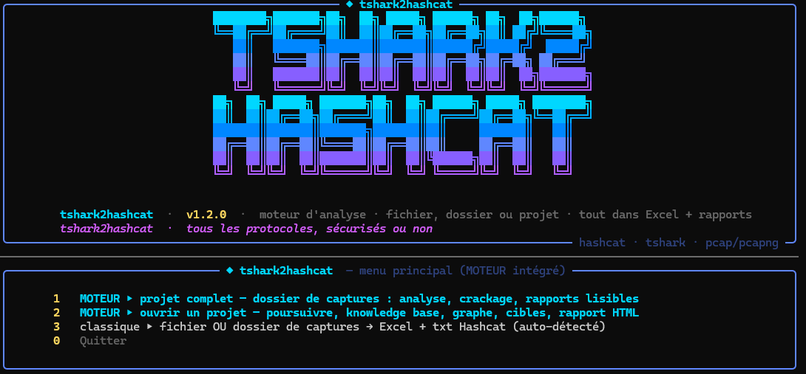

# tshark2hashcat

<p align="center">
  
</p>

<p align="center">
  Analyse de captures réseau avec TShark, extraction d'informations,<br>
  identification de cibles et préparation Hashcat.
</p>

<p align="center">
  <b>Version 1.2.0</b> · Apache-2.0
</p>

---

## Utilisation

Le lancement sans argument ouvre le CLI interactif :

```text
◆ tshark2hashcat  —  menu principal

  1.  MOTEUR ▸ projet complet — dossier de captures :
      analyse, crackage, rapports lisibles

  2.  MOTEUR ▸ ouvrir un projet :
      poursuivre, knowledge base, graphe, cibles, rapport HTML

  3.  classique ▸ fichier OU dossier de captures :
      Excel + txt Hashcat (auto-détecté)

  0.  Quitter

  Votre choix :
```

---

## 1. Nouveau projet

Le choix `1` lance le moteur complet sur un dossier de captures.

Le programme demande :

```text
Dossier de captures (.pcap/.pcapng/.cap/.json) :
Dossier de sortie :
Fichier knowledge optionnel :
Deep mode ? [o/N] :
```

Le moteur enchaîne l'analyse, les cibles, les solveurs, le post-crack et la génération des rapports.

À la fin :

```text
TOUT EST DANS : <dossier de sortie>

ouvrez d'abord GUIDE.txt (le guide), puis
RAPPORT.txt (rapport texte) ou rapport.html
(double-clic → navigateur)
```

### Résultats

Le projet conserve notamment :

```text
captures
connaissances
hashes hashcat
corrélations
déchiffrements
rounds
rapports
```

---

## 2. Ouvrir un projet

Le choix `2` permet de reprendre un projet existant contenant `data.json`.

```text
▸ PROJET — <dossier>

  1.  poursuivre — nouveaux rounds
      (solveurs → post-crack → rapports)

  2.  knowledge base — afficher / filtrer / importer

  3.  graphe de connaissances
      — graphe.dot + fenêtres temporelles

  4.  hashes hashcat
      — un dossier par hash, commandes prêtes

  5.  ouvrir le rapport HTML — navigateur

  6.  inventaire réseau
      — tout extraire d'une capture

  0.  revenir au menu principal

  Votre choix :
```

### 2.1 Poursuivre

L'analyse peut être relancée sur le même projet :

```text
Analyse
   ↓
Cibles
   ↓
Solveurs
   ↓
Post-crack
   ↓
Propagation
   ↓
Round suivant
```

Les informations récupérées peuvent être réinjectées dans le projet pour alimenter les traitements suivants.

### 2.2 Knowledge Base

Permet d'afficher, filtrer et importer les connaissances du projet.

### 2.3 Graphe

Génère notamment :

```text
graphe.dot
```

### 2.4 Hashes Hashcat

Chaque cible possède son propre dossier :

```text
<hashes>/
└── m<MODE>-<utilisateur>-<id>/
    ├── hash.txt
    ├── commande.txt
    ├── resultat.txt
    └── fiche.txt
```

`hash.txt` contient la ligne Hashcat, `commande.txt` la commande, `resultat.txt` le résultat et `fiche.txt` les informations associées à la cible.

### 2.5 Rapport HTML

Ouvre le rapport HTML du projet dans le navigateur.

### 2.6 Inventaire réseau

Extrait les informations présentes dans une capture et produit notamment des sorties TXT, JSON et CSV.

---

## 3. Mode classique

Le choix `3` permet d'analyser directement un fichier ou un dossier.

```text
Fichier OU dossier de captures
(.pcap / .pcapng / .cap / .json) :
```

Le type d'entrée est détecté automatiquement.

### Fichier

```powershell
python tshark2hashcat.py capture.pcap
```

### Dossier

```powershell
python tshark2hashcat.py .\captures
```

Le traitement des dossiers est récursif par défaut et peut utiliser le traitement parallèle.

---

## Analyse réseau

L'inventaire réseau conserve notamment :

- trames
- sources et destinations
- protocoles
- identités
- secrets
- métadonnées
- anomalies
- découvertes
- notes

Exemple de sortie :

```text
──────────────────────────────────────────────────────────────────────────
  INVENTAIRE RÉSEAU v<version> — capture.pcap
──────────────────────────────────────────────────────────────────────────
Format          : pcap   Paquets lus : <N> (<octets> octets)   tronqué : non
Durée           : <secondes> s      débit : <débit> Mo/s
Compteurs       :
  <type> = <nombre>
Parseurs lancés :
  <parseur> = <nombre>
Découvertes     : <N> uniques
Par catégorie   : ...
Par protocole   :
  <protocole> = <nombre>
```

Les valeurs extraites sont conservées en clair dans les sorties générées.

---

## Protocoles

Le code contient des traitements pour notamment :

```text
ARP
IPv4 / IPv6
TCP / UDP
ICMP
DNS
DHCP
NTP
RADIUS
SNMP
HTTP
TLS
SSH
FTP
Telnet
LDAP
Kerberos
RDP
POP3
IMAP
SMTP
MySQL
PostgreSQL
XMPP
SIP
Redis
IRC
Modbus
S7
BACnet
```

L'analyse TLS peut relever notamment le ClientHello, ServerHello, la version TLS, le SNI, l'ALPN et les informations de certificats.

---

## Solveurs

Quatre solveurs sont intégrés :

```text
auth
wpa2e
wep
sae
```

`auth` traite notamment XMPP/SASL, SCRAM, DIGEST-MD5, CRAM-MD5, PLAIN, LOGIN, HTTP Basic/Digest, POP3, IMAP, SMTP, FTP et Telnet.

`wpa2e` analyse notamment RADIUS, EAPOL, PMK, PTK, MIC et AES-CCMP.

`wep` prend notamment en charge WEP-40, IV, known plaintext, ICV et CRC32.

`sae` traite notamment PWE, masks, confirmation, KCK, PMK, PTK, KEK, TK, GTK et CCMP.

---

## Hashcat

Modes déclarés :

```text
20
4800
5500
5600
7500
11400
13100
16500
18200
19600
19700
19800
19900
22000
32100
32200
```

Les commandes générées peuvent notamment utiliser une wordlist et `--show`.

Les résultats du cracking sont intégrés au projet et peuvent alimenter les traitements suivants.

---

## Extraction

Options principales :

```text
-Y
-d
--limit
-x
```

Désactivation de traitements :

```text
--no-ntlm
--no-kerberos
--no-wpa
--no-apop
--no-creds
--no-raw
```

---

## Gros volumes

Pour les captures importantes, le programme peut utiliser `editcap` afin de découper une capture, traiter les morceaux en parallèle puis regrouper les résultats.

Extensions reconnues :

```text
.pcap
.pcapng
.cap
.dmp
```

---

## Options CLI

```text
--lang fr|en
--no-banner
--no-color
--quiet
--verbose
--no-progress
--config
--tshark
```

Exemple :

```powershell
python tshark2hashcat.py --lang fr
```

---

## Diagnostic

```powershell
python tshark2hashcat.py doctor
```

La commande vérifie notamment TShark/Wireshark, les dépendances Python, les solveurs et leurs self-tests.

---

## Formats

```text
TXT
CSV
JSON
XLSX
HTML
Markdown
PCAP
PCAPNG
```

---

## Licence

Apache-2.0
